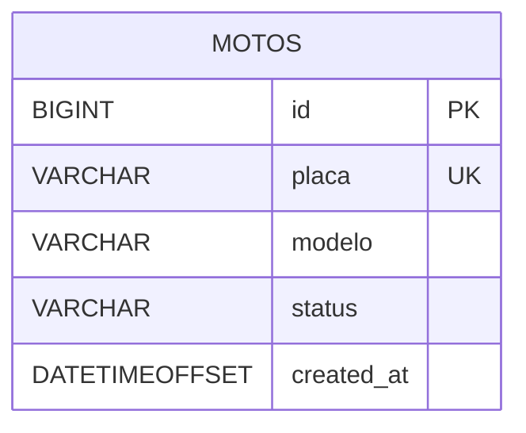

# CloudSprint3 · Spring Boot + Azure SQL · DevOps Sprint

<p align="center">
  
  
  
  
</p>

API simples para gestão de **motos** (CRUD) construída com **Spring Boot** e banco **Azure SQL**.  
O deploy é realizado no **Azure App Service** via **GitHub Actions** e a observabilidade usa **Application Insights**.

> **URL pública** (exemplo): `https://cloudsprint3-rm556620.azurewebsites.net`  
> **Swagger UI**: `/swagger-ui/index.html` · **OpenAPI**: `/v3/api-docs`

---

## 📚 Sumário

- [Arquitetura](#-arquitetura)
- [Tecnologias](#-tecnologias)
- [Endpoints](#-endpoints)
- [Como executar localmente](#-como-executar-localmente)
- [Configuração no Azure](#-configuração-no-azure)
- [Fluxo de CI/CD](#-fluxo-de-cicd)
- [Modelo de dados](#-modelo-de-dados)
- [Coleção Postman](#-coleção-postman)
- [Exemplos de requisição](#-exemplos-de-requisição)
- [Resolução de problemas](#-resolução-de-problemas)
- [Licença](#-licença)

---

## 🏗 Arquitetura

### Diagrama lógico (Mermaid)


> Dica: para múltiplas linhas no Mermaid em nós, use `<br/>` nos rótulos.

---

## 🧰 Tecnologias

- **Java 17** · **Spring Boot 3.3.5**
- **Spring Web**, **Validation**, **Spring Data JPA**
- **Driver** `com.microsoft.sqlserver:mssql-jdbc`
- **Swagger/OpenAPI** via `springdoc-openapi`
- **H2** para testes locais (profile `h2`)
- **Azure**: App Service (Linux), Azure SQL, Application Insights
- **CI/CD**: GitHub Actions (deploy por Publish Profile)

---

## 🔗 Endpoints

Base path: `/api/v1`

| Método | Caminho              | Descrição               |
|-------:|----------------------|-------------------------|
| GET    | `/motos`             | Lista todas             |
| GET    | `/motos/{id}`        | Busca por ID            |
| POST   | `/motos`             | Cria uma moto           |
| PUT    | `/motos/{id}`        | Atualiza uma moto       |
| DELETE | `/motos/{id}`        | Remove uma moto         |

**Modelo (request/response):**
```json
{
  "id": 1,
  "placa": "ABC1D23",
  "modelo": "Honda CG 160",
  "status": "ATIVA",
  "createdAt": "2025-09-27T12:34:56-03:00"
}
```

---

## ▶️ Como executar localmente

### Pré-requisitos
- JDK 17+
- Maven 3.9+

### Usando H2 (memória)
```bash
mvn spring-boot:run -Dspring-boot.run.profiles=h2
# Swagger: http://localhost:8080/swagger-ui/index.html
# H2 Console: http://localhost:8080/h2-console  (JDBC URL: jdbc:h2:mem:testdb)
```

### Usando SQL Server (local/Azure)
Configure `src/main/resources/application.properties` (ou via variáveis de ambiente):
```
spring.datasource.url=jdbc:sqlserver://<server>.database.windows.net:1433;database=<db>;encrypt=true;trustServerCertificate=false;hostNameInCertificate=*.database.windows.net;loginTimeout=30;
spring.datasource.username=<usuario>
spring.datasource.password=<senha>
spring.jpa.hibernate.ddl-auto=update
```

Execute:
```bash
mvn clean package -DskipTests
java -jar target/sprint3-sqlserver-0.0.1-SNAPSHOT.jar
```

---

## ☁️ Configuração no Azure

1) **App Service (Linux)** e **Azure SQL** (via CLI/Portal).  
2) **App Settings** no App Service:
   - `SPRING_DATASOURCE_URL`
   - `SPRING_DATASOURCE_USERNAME`
   - `SPRING_DATASOURCE_PASSWORD`
   - (Opcional) `APPLICATIONINSIGHTS_CONNECTION_STRING`

3) **Firewall do Azure SQL**: libere acesso para o App Service (ou use Private Endpoint).

> A criação automatizada (RG, SQL, WebApp, Insights) pode ser feita com o script `deploy-cloud-*.sh`.

---

## 🚀 Fluxo de CI/CD

GitHub Action (`.github/workflows/main_cloudsprint3-rm556620.yml`):

- **Build:** `mvn -B -DskipTests package`
- **Artefato:** `target/*.jar`
- **Deploy:** `azure/webapps-deploy@v2` usando o secret `AZURE_WEBAPP_PUBLISH_PROFILE`  
  (pegue o XML em **App Service → Get publish profile** e salve como secret).

> O App Service executa o jar como `app.jar`. O Manifest do jar é configurado pelo `spring-boot-maven-plugin`.

---

## 🗃 Modelo de dados

### Diagrama ER (Mermaid)


### SQL de referência
```sql
CREATE TABLE IF NOT EXISTS motos (
  id BIGINT IDENTITY(1,1) PRIMARY KEY,
  placa VARCHAR(10) NOT NULL UNIQUE,
  modelo VARCHAR(80) NOT NULL,
  status VARCHAR(30) NOT NULL,
  created_at DATETIMEOFFSET NOT NULL DEFAULT SYSDATETIMEOFFSET()
);
```

---

## 🧪 Coleção Postman

- Baixe a coleção pronta: **CloudSprint3.postman_collection.json** (neste repositório).  
- Defina a variável `host` no Postman: `https://cloudsprint3-rm556620.azurewebsites.net` (ou `http://localhost:8080`).

> Use **environments** para alternar entre **local** e **azure**.

---

## 📬 Exemplos de requisição

### Criar
```http
POST {{host}}/api/v1/motos
Content-Type: application/json

{
  "placa": "ABC1D23",
  "modelo": "Honda CG 160",
  "status": "ATIVA"
}
```

### Listar
```http
GET {{host}}/api/v1/motos
```

### Buscar por ID
```http
GET {{host}}/api/v1/motos/1
```

### Atualizar
```http
PUT {{host}}/api/v1/motos/1
Content-Type: application/json

{
  "placa": "ABC1D23",
  "modelo": "Honda CG 160 Start",
  "status": "EM_MANUTENCAO"
}
```

### Remover
```http
DELETE {{host}}/api/v1/motos/1
```

---

## 🛠 Resolução de problemas

- **Swagger abre mas a raiz `"/"` dá 404**: use `/swagger-ui/index.html`.  
  (Opcional: crie um `HomeController` que redireciona `/` → Swagger.)

- **Erro “no main manifest attribute” no Azure**:  
  Garanta que o jar foi gerado pelo `spring-boot-maven-plugin` e que o deploy apontou para `target/*.jar`.

- **Sem conexão com banco**:  
  Revise `SPRING_DATASOURCE_URL/USERNAME/PASSWORD`. No Azure SQL, confirme a **regra de firewall**.

- **H2 falha com tipos do SQL Server**:  
  Rode com `-Dspring-boot.run.profiles=h2` ou use script específico para H2.

---

## 📄 Licença

MIT — faça bom uso! :)
