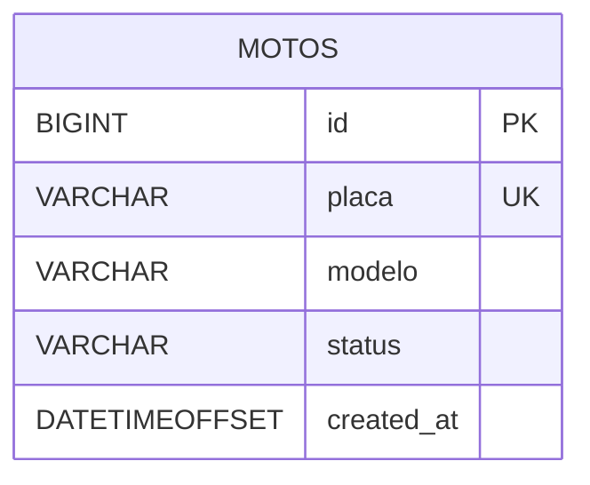

# CloudSprint3 · Spring Boot + Azure SQL · DevOps Sprint

<p align="center">
  
  
  
  
</p>

API simples para gestão de **motos** (CRUD) construída com **Spring Boot** e banco **Azure SQL**.  
O deploy é realizado no **Azure App Service** via **GitHub Actions** e a observabilidade usa **Application Insights**.

⚙️ Opção Escolhida
A equipe optou pela **Opção 2 – Serviço de Aplicativo (App Service + Azure SQL)**, modelo **PaaS**.  
A aplicação foi publicada em um **Azure App Service (Linux)** conectado a um **Azure SQL Database**, atendendo aos requisitos da disciplina.

---

## 📚 Sumário

- [Arquitetura](#-arquitetura)
- [Tecnologias](#-tecnologias)
- [Endpoints](#-endpoints)
- [Como executar localmente](#-como-executar-localmente)
- [Configuração no Azure](#-configuração-no-azure)
- [Fluxo de CI/CD](#-fluxo-de-cicd)
- [Modelo de dados](#-modelo-de-dados)
- [Coleção Postman](#-coleção-postman)
- [Exemplos de requisição](#-exemplos-de-requisição)
- [Resolução de problemas](#-resolução-de-problemas)

---

## 🏗 Arquitetura

### Diagrama lógico (Mermaid)


> Dica: para múltiplas linhas no Mermaid em nós, use `<br/>` nos rótulos.

---

## 🧰 Tecnologias

- **Java 17** · **Spring Boot 3.3.5**
- **Spring Web**, **Validation**, **Spring Data JPA**
- **Driver** `com.microsoft.sqlserver:mssql-jdbc`
- **Swagger/OpenAPI** via `springdoc-openapi`
- **H2** para testes locais (profile `h2`)
- **Azure**: App Service (Linux), Azure SQL, Application Insights
- **CI/CD**: GitHub Actions (deploy por Publish Profile)

---

## 🔗 Endpoints

Base path: `/api/v1`

| Método | Caminho              | Descrição               |
|-------:|----------------------|-------------------------|
| GET    | `/motos`             | Lista todas             |
| GET    | `/motos/{id}`        | Busca por ID            |
| POST   | `/motos`             | Cria uma moto           |
| PUT    | `/motos/{id}`        | Atualiza uma moto       |
| DELETE | `/motos/{id}`        | Remove uma moto         |

**Modelo (request/response):**
```json
{
  "id": 1,
  "placa": "ABC1D23",
  "modelo": "Honda CG 160",
  "status": "ATIVA",
  "createdAt": "2025-09-27T12:34:56-03:00"
}
```

---

## ☁️ Configuração no Azure

1) **App Service (Linux)** e **Azure SQL** (via CLI/Portal).  
2) **App Settings** no App Service:
   - `SPRING_DATASOURCE_URL`
   - `SPRING_DATASOURCE_USERNAME`
   - `SPRING_DATASOURCE_PASSWORD`
   - (Opcional) `APPLICATIONINSIGHTS_CONNECTION_STRING`

3) **Firewall do Azure SQL**: libere acesso para o App Service (ou use Private Endpoint).

> A criação automatizada (RG, SQL, WebApp, Insights) pode ser feita com o script `deploy-cloud-*.sh`.

---

# 🚀 Deploy no Azure (Portal + Cloud Shell)

## ✅ Pré-requisitos
- Assinatura válida no Azure.
- Repositório no GitHub com o workflow de deploy configurado.
- Script `deploy-cloud-marcus.sh` na raiz do projeto (ou disponível para upload).

---

## 1) Acessar o Portal & abrir o Cloud Shell
1. Entre em https://portal.azure.com  
2. Clique no ícone **Cloud Shell** (topo direito) e escolha **Bash** (ou PowerShell, se preferir).

---

## 2) Enviar e executar o script de provisionamento
No Cloud Shell:
```bash
# 2.1) Faça upload do arquivo `deploy-cloud-marcus.sh` (botão Upload/Download)
# 2.2) Dê permissão e execute:
chmod +x ./deploy-cloud-marcus.sh
./deploy-cloud-marcus.sh
```

O script irá:
- Criar **Resource Group**, **App Service Plan (Linux)**, **Web App**, **Azure SQL Database** e **Application Insights**  
- Configurar **App Settings** (JDBC/credenciais)  
- Exibir informações úteis (nome do App, região, etc.)

> Aguarde o término. Não feche o Cloud Shell até ver a conclusão.

---

## 3) Configurar o GitHub Actions (Publish Profile)
1. No **App Service** criado → **Get publish profile** (Obter perfil de publicação).  
2. Copie o **XML** gerado.  
3. No **GitHub** do projeto → **Settings → Secrets and variables → Actions → New repository secret**.  
4. Crie/atualize o secret:
   - **Name:** `AZURE_WEBAPP_PUBLISH_PROFILE`  
   - **Value:** *(cole o XML copiado)*

---

## 4) Confirmar o workflow de deploy
- Verifique se o arquivo do workflow aponta para o **mesmo nome de Web App** criado pelo script.  
- O job de deploy deve usar a action:
  ```yaml
  - name: Deploy to Azure WebApp
    uses: azure/webapps-deploy@v2
    with:
      app-name: <nome-do-seu-app-service>
      publish-profile: ${{ secrets.AZURE_WEBAPP_PUBLISH_PROFILE }}
      package: target/*.jar
  ```
- Se necessário, **commite** qualquer ajuste para disparar o pipeline, ou acione **Re-run jobs** em **Actions**.

---

## 5) Acompanhar o deploy
- GitHub → **Actions** → selecione o workflow de deploy → monitore os logs até **Success**.  
- No Azure Portal, confira em **App Service → Deployment Center / Logs**.

---

## 6) Validar a aplicação em produção
- URL do App (ex.):  
  ```
  https://<SEU-APP>.azurewebsites.net
  ```
- Swagger UI:
  ```
  https://<SEU-APP>.azurewebsites.net/swagger-ui/index.html
  ```
- Testes rápidos (cURL):
  ```bash
  # CREATE
  curl -X POST "https://<SEU-APP>.azurewebsites.net/api/v1/motos"     -H "Content-Type: application/json"     -d '{"placa":"ABC1D23","modelo":"Honda CG 160","status":"ATIVA"}'

  # LIST
  curl "https://<SEU-APP>.azurewebsites.net/api/v1/motos"
  ```

---

## 🧯 Troubleshooting rápido
- **403/Timeout na API:** verifique **SPRING_DATASOURCE_URL/USERNAME/PASSWORD** e **firewall do Azure SQL**.  
- **Falha no deploy:** confira se o secret `AZURE_WEBAPP_PUBLISH_PROFILE` está correto e se o **nome do app** bate com o do workflow.  
- **Jar inválido:** gere novamente com:
  ```bash
  mvn -B -DskipTests package
  ```
- **Logs de aplicação:** em **App Service → Log stream** ou em **Application Insights**.

---

## 🔐 Boas práticas (produção)
- Mantenha credenciais em **Secrets/App Settings** (nunca no repositório).  
- Habilite **HTTPS Only** no App Service.  
- Restrinja o **firewall** do Azure SQL (evite regra ampla em produção).  
- Use **Slots de Deploy** para zero-downtime (opcional).

---

## 🧹 Limpeza (opcional)
Para remover todos os recursos criados (atenção: ação destrutiva):
```bash
az group delete -n <SEU_RESOURCE_GROUP> --yes --no-wait
```


---

## 🗃 Modelo de dados

### Diagrama ER (Mermaid)


### SQL de referência
```sql
CREATE TABLE IF NOT EXISTS motos (
  id BIGINT IDENTITY(1,1) PRIMARY KEY,
  placa VARCHAR(10) NOT NULL UNIQUE,
  modelo VARCHAR(80) NOT NULL,
  status VARCHAR(30) NOT NULL,
  created_at DATETIMEOFFSET NOT NULL DEFAULT SYSDATETIMEOFFSET()
);
```

---

## 📬 Exemplos de requisição

### Criar
```http
POST {{host}}/api/v1/motos
Content-Type: application/json

{
  "placa": "ABC1D23",
  "modelo": "Honda CG 160",
  "status": "ATIVA"
}
```

### Listar
```http
GET {{host}}/api/v1/motos
```

### Buscar por ID
```http
GET {{host}}/api/v1/motos/1
```

### Atualizar
```http
PUT {{host}}/api/v1/motos/1
Content-Type: application/json

{
  "placa": "ABC1D23",
  "modelo": "Honda CG 160 Start",
  "status": "EM_MANUTENCAO"
}
```

### Remover
```http
DELETE {{host}}/api/v1/motos/1
```

---

👥 Desenvolvedores
Marcus Vinicius de Souza Calazans — RM: 556620
Lucas Abud Berbel — RM: 557957
