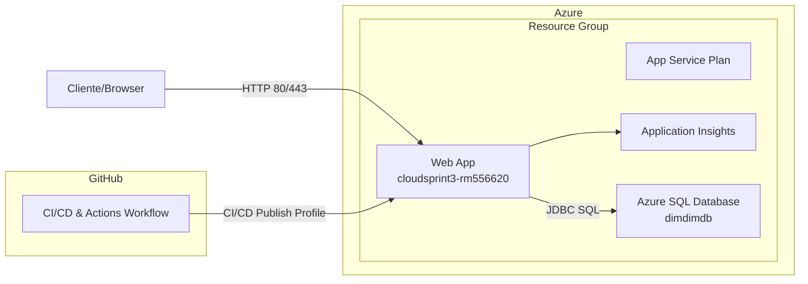
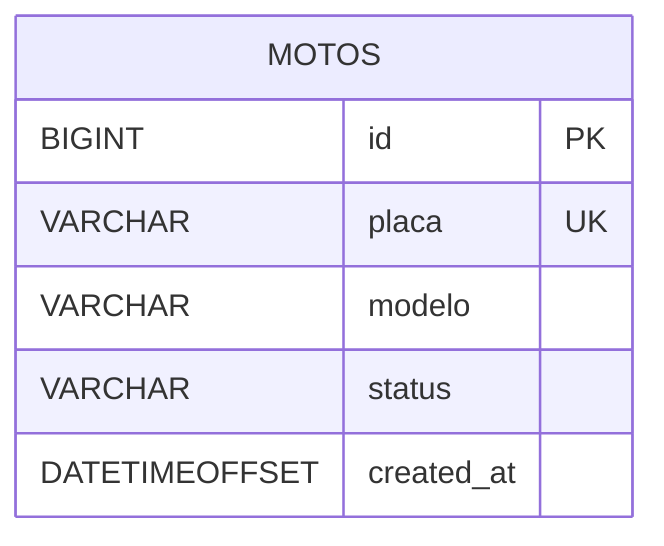

# CloudSprint3 — Spring Boot + Azure SQL + GitHub Actions

> API de motos para a Sprint 3 (DevOps). Deploy automático no **Azure App Service** com banco **Azure SQL**.

## Endpoints
- `GET /api/v1/motos` – lista todas
- `GET /api/v1/motos/{id}` – busca por id
- `POST /api/v1/motos` – cria
- `PUT /api/v1/motos/{id}` – atualiza
- `DELETE /api/v1/motos/{id}` – remove

Swagger: `https://<SEU_APP>.azurewebsites.net/swagger-ui/index.html`  
OpenAPI JSON: `/v3/api-docs`

---

## Arquitetura (diagramas)

### Diagrama lógico (Mermaid)
> Visualização da app no Azure com Azure SQL e GitHub Actions.



### Diagrama ER (Mermaid)
> Modelo mínimo usado pela API.



> **Dica GitHub**: em Mermaid use **```` ```mermaid ````** e quebras de linha com `<br/>` dentro dos rótulos quando quiser múltiplas linhas.

---

## Exemplos (Postman)

### 1) Criar moto
```
POST {{host}}/api/v1/motos
Content-Type: application/json

{
  "placa": "ABC1D23",
  "modelo": "Honda CG 160",
  "status": "ATIVA"
}
```
**Resposta 201**
```json
{
  "id": 1,
  "placa": "ABC1D23",
  "modelo": "Honda CG 160",
  "status": "ATIVA",
  "createdAt": "2025-09-27T12:34:56-03:00"
}
```

### 2) Listar
```
GET {{host}}/api/v1/motos
```

### 3) Buscar por id
```
GET {{host}}/api/v1/motos/1
```

### 4) Atualizar
```
PUT {{host}}/api/v1/motos/1
Content-Type: application/json

{
  "placa": "ABC1D23",
  "modelo": "Honda CG 160 Start",
  "status": "EM_MANUTENCAO"
}
```

### 5) Remover
```
DELETE {{host}}/api/v1/motos/1
```

> Importe a coleção: `CloudSprint3.postman_collection.json`

---

## Deploy (resumo)

1. Configure os _app settings_ no App Service:
   - `SPRING_DATASOURCE_URL`
   - `SPRING_DATASOURCE_USERNAME`
   - `SPRING_DATASOURCE_PASSWORD`

2. Crie o *publish profile* (XML) e adicione em **GitHub Secrets** como `AZURE_WEBAPP_PUBLISH_PROFILE`.

3. O workflow compila (`mvn -DskipTests package`) e faz upload do `target/*.jar`.

---

## Executar local (H2)
```
mvn spring-boot:run -Dspring-boot.run.profiles=h2
```

---

## Licença
MIT
